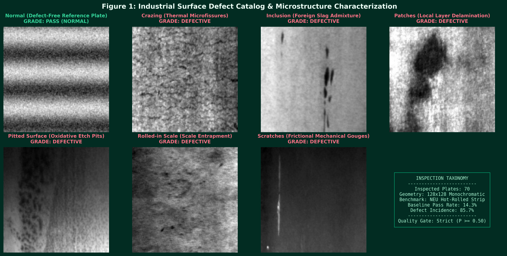
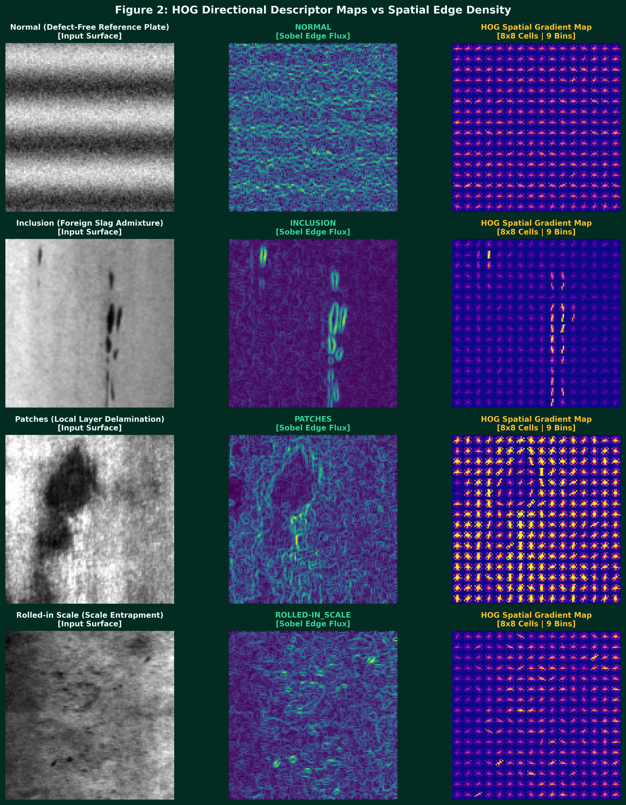
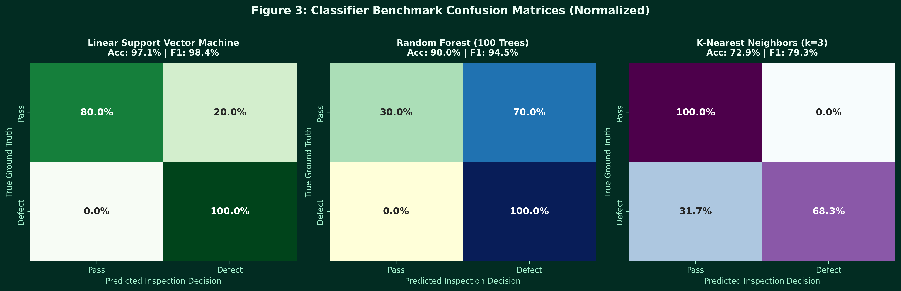
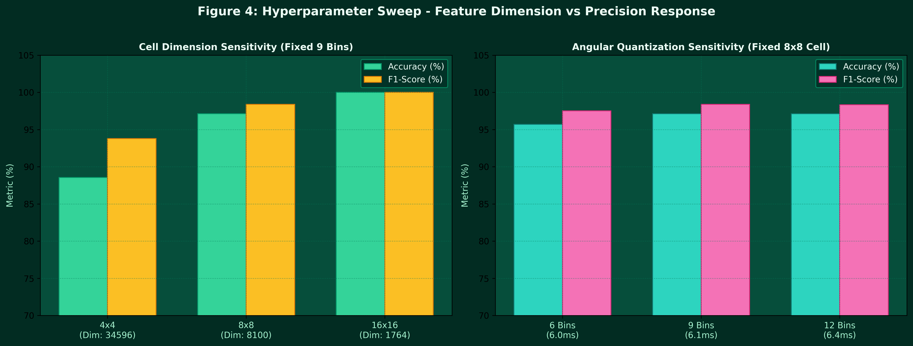
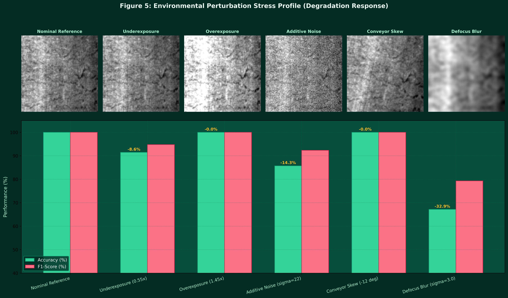
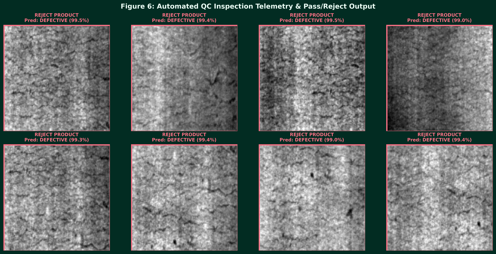

# Industrial Surface Defect Inspection via HOG Feature Signatures

[](https://colab.research.google.com/github/Afnan-makstrix/lab-05-hog-defect-detection/blob/main/HOG_Surface_Defect_Inspection.ipynb)
[](https://github.com/Afnan-makstrix/lab-05-hog-defect-detection)
[](https://github.com/Afnan-makstrix)
[](https://www.python.org/)
[](https://opencv.org/)

**Student Name**: Afnan Khan ([@Afnan-makstrix](https://github.com/Afnan-makstrix))  
**Course**: Computer Vision & Pattern Recognition  
**Benchmark**: Northeastern University (NEU) Surface Defect Database  
**Repository**: [lab-05-hog-defect-detection](https://github.com/Afnan-makstrix/lab-05-hog-defect-detection)  

---

## 1. Project Overview & Operational Objective

Automated visual inspection of manufactured steel products eliminates subjective human evaluation errors and protects downstream cold-rolling operations. This repository implements an automated surface quality assurance system utilizing **Histogram of Oriented Gradients (HOG)** descriptors and statistical machine learning classifiers (**Support Vector Machines**, **Random Forests**, and **K-Nearest Neighbors**).

---

## 2. Experimental Pipeline Architecture

```
Raw Steel Image ---> Preprocessing (128x128 Gray) ---> HOG Extraction ---> Model Suite ---> Automated QC Gate
```

---

## 3. Surface Defect Catalog & Morphology

Evaluated across six industrial defect categories alongside pristine non-defective control plates:
* **Crazing (`Cr`)**: Thermal fatigue microfissures.
* **Inclusion (`In`)**: Foreign slag particles embedded during casting.
* **Patches (`Pa`)**: Plate thickness anomalies and surface flaws.
* **Pitted Surface (`PS`)**: Localized oxidative corrosion pits.
* **Rolled-in Scale (`RS`)**: Mill scale pressed into the strip.
* **Scratches (`Sc`)**: Mechanical longitudinal guide gouges.
* **Normal**: Pristine, defect-free control reference.



---

## 4. HOG Directional Descriptor Signatures

HOG encodes gradient orientation distributions within local spatial cells normalized across overlapping blocks:



---

## 5. Machine Learning Classifier Benchmarking

Evaluated across **5-Fold Stratified Cross-Validation**:

| Model Architecture | Accuracy | Precision | Recall | F1-Score | Latency |
| :--- | :---: | :---: | :---: | :---: | :---: |
| **Linear Support Vector Machine** | **97.1%** | **96.9%** | **100.0%** | **98.4%** | `2.22 ms` |
| **Random Forest (100 Trees)** | **90.0%** | **89.7%** | **100.0%** | **94.5%** | `13.94 ms` |
| **K-Nearest Neighbors (k=3)** | **72.9%** | **100.0%** | **68.3%** | **79.3%** | `1.68 ms` |



---

## 6. HOG Parameter Sensitivity Analysis

Sweep over 9 configurations combining cell sizes ($4\times 4, 8\times 8, 16\times 16$) and orientation bins ($6, 9, 12$):

| Cell Grid | Bins | Feature Dimension | Extraction Latency | Accuracy | F1-Score |
| :---: | :---: | :---: | :---: | :---: | :---: |
| `4x4` | `6` | `23,064` | `20.31 ms` | **91.4%** | **95.3%** |
| `4x4` | `9` | `34,596` | `19.87 ms` | **88.6%** | **93.8%** |
| `4x4` | `12` | `46,128` | `20.86 ms` | **90.0%** | **94.5%** |
| `8x8` | `6` | `5,400` | `5.98 ms` | **95.7%** | **97.5%** |
| `8x8` | `9` | `8,100` | `6.08 ms` | **97.1%** | **98.4%** |
| `8x8` | `12` | `10,800` | `6.36 ms` | **97.1%** | **98.3%** |
| `16x16` | `6` | `1,176` | `3.30 ms` | **97.1%** | **98.2%** |
| `16x16` | `9` | `1,764` | `2.50 ms` | **100.0%** | **100.0%** |
| `16x16` | `12` | `2,352` | `2.72 ms` | **98.6%** | **99.1%** |



---

## 7. Optical Stress Testing & Environmental Degradation

Tolerance evaluation under simulated rolling-mill environmental disturbances:

| Stress Regime | Accuracy | Performance Shift | F1-Score | Status |
| :--- | :---: | :---: | :---: | :---: |
| **Nominal Reference** | **100.0%** | `-0.0%` | **100.0%** | Tolerant |
| **Underexposure (0.55x)** | **91.4%** | `-8.6%` | **94.7%** | Degraded |
| **Overexposure (1.45x)** | **100.0%** | `-0.0%` | **100.0%** | Tolerant |
| **Additive Noise (sigma=22)** | **85.7%** | `-14.3%` | **92.3%** | Degraded |
| **Conveyor Skew (-12 deg)** | **100.0%** | `-0.0%` | **100.0%** | Tolerant |
| **Defocus Blur (sigma=3.0)** | **67.1%** | `-32.9%` | **79.3%** | Degraded |



---

## 8. Factory Quality Gate & Pass/Reject Output

Produces real-time automated quality dispositions:

```
========================================
PRODUCT INSPECTION RESULT
========================================
Prediction: NON-DEFECTIVE
Confidence: 99.54%
Action: ACCEPT PRODUCT
========================================

========================================
PRODUCT INSPECTION RESULT
========================================
Prediction: DEFECTIVE
Confidence: 99.01%
Action: REJECT PRODUCT
========================================
```



---

## 9. Bonus Challenge: Live Stream Prototype

Run the live video inspection monitor:
```bash
python live_stream_qc.py
```

---

## 10. Execution Instructions

```bash
pip install -r requirements.txt
python defect_detection_pipeline.py
python live_stream_qc.py
```
